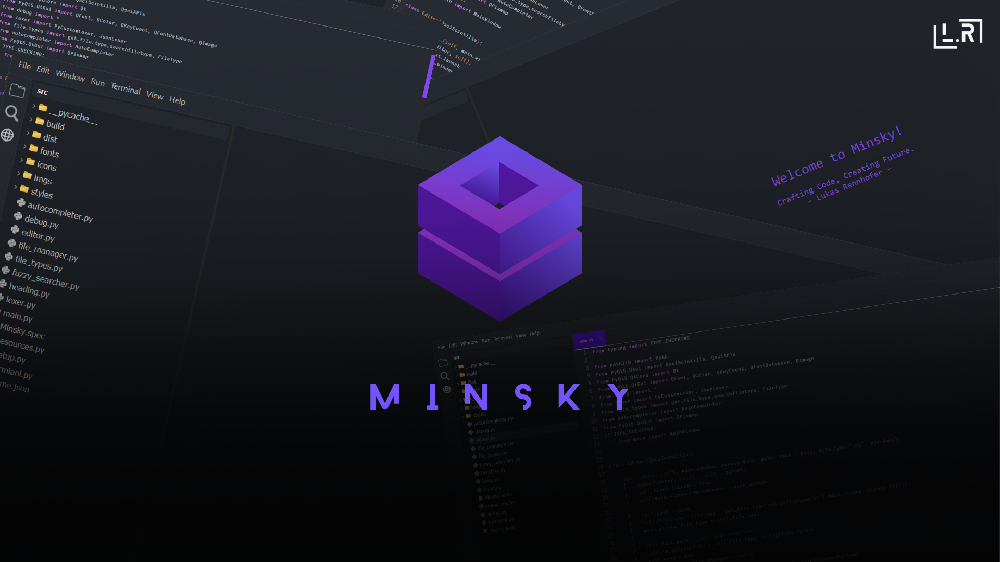

# Minsky

<p align="center">
    
</p>

---

<p align="center">
  
  
  
  
  
</p>

<br>

<p align="center">
  
  
</p>

---

## About Minsky

Minsky is a hobby-project of mine trying to createa simple to configure code editor, which is written in Python, to easily modify it and write plug-ins for it.

It should behave and feel like vscode but with vim and neovim aspects including theme-cusomizability, to give each editor a personality.

---

## Screenshots

<p align="center">
    
</p>

<p align="center">
     
</p>

---

## Getting Started

### Download

You can download the latest version of Minsky from:

- Our [Website (Not done)]()
- The [Releases Tab](https://github.com/LL-Program/Minsky/releases)

> **Note**: Currently, Minsky supports only Windows x64 systems.

### Build Instructions

#### Windows

1. Clone the repository:

   ```bash
   git clone https://github.com/LL-Program/CHIF-Engine.git
   ```

2. Navigate to the project directory:

   ```bash
   cd Minsky/src
   ```

3. Ensure the ```BUILD_MODE``` is set to ```True``` in ```Settings/datapaths.py```
   ```Settings/datapaths.py
   BUILD_MODE = True
   ```
4. Build the Exe with the sh script:
   ```bash
   bash build.sh
   ```
5. Navigate to the ```MinskyBuild``` folder, where the Exe will be located
   

#### Linux

- **Status**: Not currently supported. Building on Linux may lead to errors due to limited development resources.
---

## Features

- Cross-platform (Windows, with future plans for Linux).
- Custom Themes
- Custom Lexers, language support
- AI compatibility (Ollama) - Coming Soon!
- Terminal Integration

---

## Documentation

- **Documentation**: *Currently in progress.* Stay tuned for updates.

---

## Roadmap & Todos

Check out our [Todo List](Ressources/Pages/Todo.md) for upcoming features and tasks.
