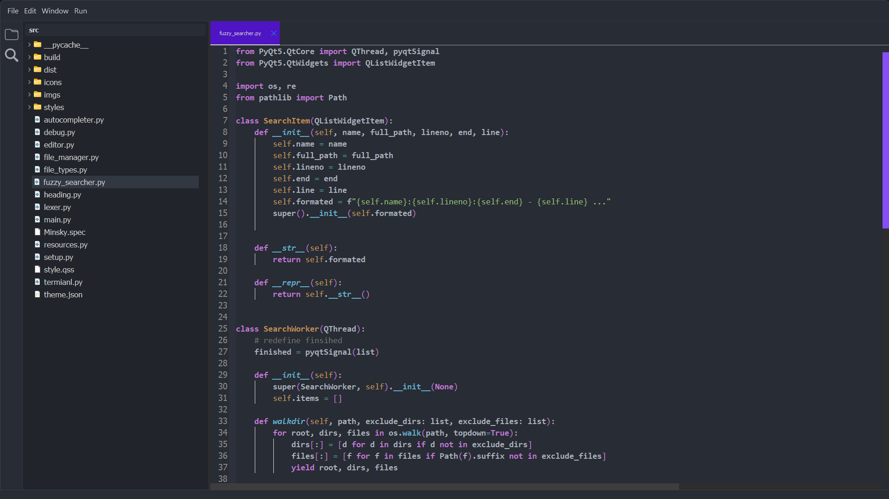

A lightweight and completely customizable Code Editor for your imagination!


## Coming Soon!⚠️

Still in Work will be releases Soon


## Features

- Light/dark mode toggle
- Live previews
- Fullscreen mode
- Cross platform


## Screenshots




## Installation

Install my-project with npm

```bash
  npm install my-project
  cd my-project
```
    
## Usage/Examples

```javascript
import Component from 'my-project'

function App() {
  return <Component />
}
```


## Documentation

[Documentation](https://linktodocumentation)


## License

[MIT](https://choosealicense.com/licenses/mit/)


## Used By

This project is used by the following companies:

- Company 1
- Company 2


## Authors

- [@octokatherine](https://www.github.com/octokatherine)

