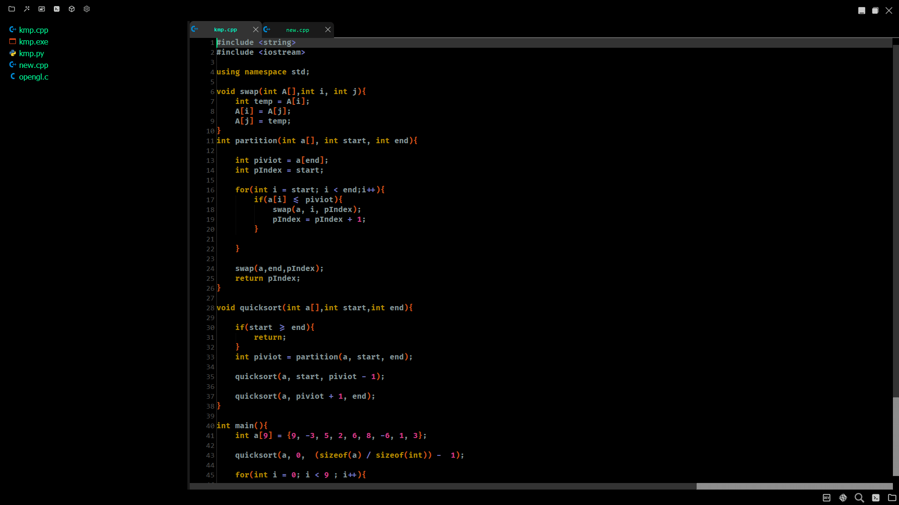
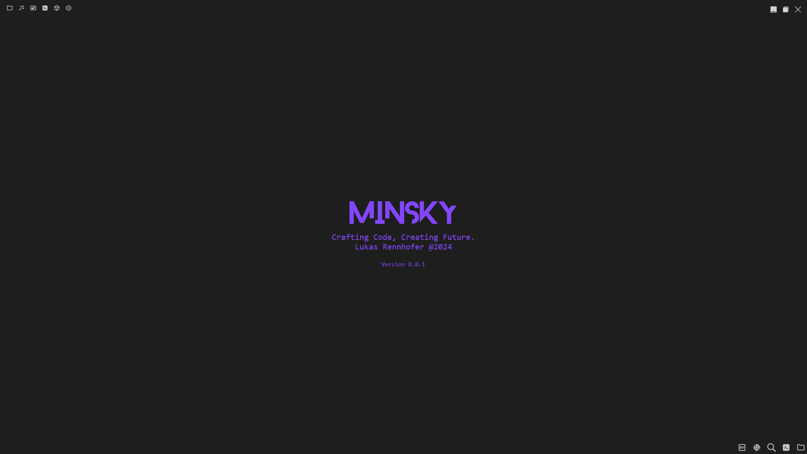
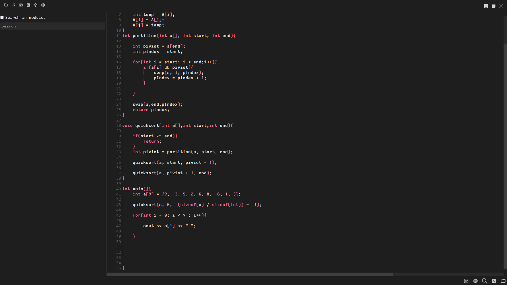

A lightweight and completely customizable Code Editor for your imagination!


## Project will be revived soon!⚠️


## Features

- Fast and lightweight than never before
- Big language support
- Fully Customizable
- Cross platform


## Screenshots
-Last Updatet 1.7.2024



## Build or Run

Build Minsky with --- or run it with python directly!

```bash
  > pip install requirements.txt
  > python src/main.py
```
OR
```bash
  --Build comming Soon!--
```
    
## Usage/Examples for Minsky API

```python
#Comming Soon!
```
## Documentation

[Documentation](https://linktodocumentation)



## License

[MIT](https://choosealicense.com/licenses/mit/)


## Used By

This project is used by the following people/Companys:

- @LL-program
- @Gregtechuser


## Authors

- [@LL-program](https://www.github.com/LL-program)

